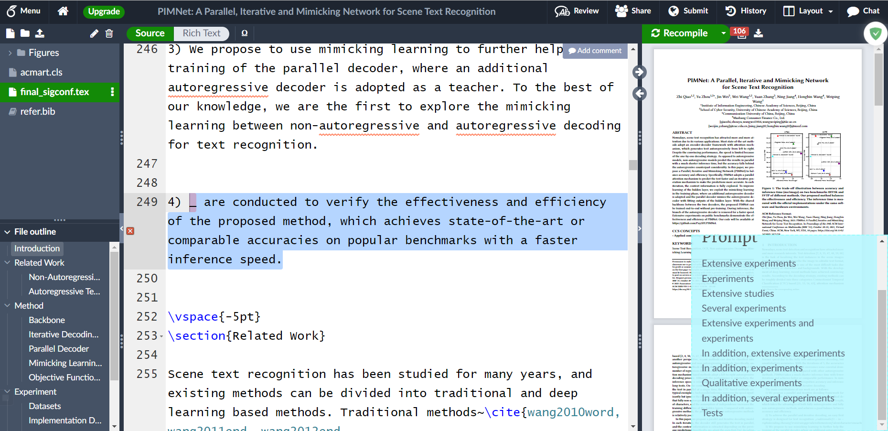

# AcademicWritingAssistant

This is an AI tool to help inexperienced researchers to write more "SOTA" expression in academic papers. **The user have to write most of their paper and this tool can help them to finish it by proposing some phrase or word suggestions at the specified position**. You can see the running result in the [Example](#example) section.

The core of this tool is a deep learning language model called T5, which is pre-trained on huge amounts of data, and I fine-tuned it on the papers in arXiv. For now, I just train the model for **Machine Learning and Deep Learning researchers** using papers which are updated in September 2022 in arXiv, maybe in the future, more data and more area will be considered.

I Export the model to `onnx` and quantize it, so a laptop without GPU or high quality hardware can run it smoothly. I tested the whole tool on my laptop, whose CPU is i5-6300HQ, and the average time to provide 10 candidates for every sentence is less than 0.5 second, and this result may change depending on your computer hardware.

### Installation

This tool contains two parts, the server and the front end. The core of this tool is the server, which runs the fine-tuned T5 and export http port for any other program to call it. I also provide a simple front end which can be used in overleaf. In fact, the front end can be used in any website, but I'm not skilled in javascript. So I have to design it as each time when user copy text, the copied text will be sent to the server. In order not to bother the daily use, the front end is designed to be launched just in overleaf.

#### Prepare server

+ Install Python 3.7.13 (I have not tested on other version, but all version of Python 3.7 may be ok, I guess.)

+ Install requirements
  
  ```shell
  pip install fastT5==0.1.4 django==3.2.15
  ```

+ Download pre-trained checkpoint from [here](https://github.com/AlbertShenC/AcademicWritingAssistant/releases) and save it at `./model/ckpt/`:
  
  
  
  You can download `decoder.onnx` `encoder.onnx` `init-decoder.onnx` for original setting, or `decoder-quantized.onnx` `encoder-quantized.onnx` `init-decoder-quantized.onnx` setting, or all the checkpoint as your own will. The original one is bigger, slower but performance better.

#### Prepare front end

+ Install `tampermonkey`, a browser plugin to run self-define javascript in brower, which can be installed in Chrome, Edge, Firefox and so on.

+ Create a tampermonkey script by copying all content from `OverleafWebPlugin.js`

### Usage

+ Run server
  
  ```shell
  python manage.py runserver localhost:8000
  ```

+ Open overleaf and enjoy it! Each time you copy something from overleaf, all text you have copied will be sent the server we mentioned above, and the front end will show the result returned from the server.

**All program are run locally and network connection is not needed**. So no one will get and store your papers, emmm, except for overleaf.

If all things go right, you will see `Model not loaded` or `Origin model loaded` or `Quantized model loaded`  on the suspended window in the lower right corner depending on your server state. I provide two kinds of model for you, the `Origin` one and the `Quantized` one. The `Origin` model will give a little bit better suggestion while run slower. You can switch it as your own will.


### Example

The words you need the Assistant to write should be replaced by `_`, and I'm suggesting you do not write too many `_` in one time because this may decrease the performance of the model. In theory, the model can handle up to 100 `_` as the same time, but we all know, theory is beautify and hard to realize. So I restrict the max number of `_` to 10, and **I do suggest you to place just one `_` in one time**.

The `_` can be placed at any place, whether in the middle, begin, or end of the sentence. The input sentence of the model should not be longer than 512 subwords, which is usually about 200-300 words, otherwise, the sentence will be truncated automatically. What the model can see is what you copy, so the more you copy and the better the model can understand the context, but make sure that do not copy too long to exceed 512 subwords.

This is a paper called [PIMNet](https://arxiv.org/abs/2109.04145), which is not seen by the model before, and I will use it as our example. All the copied text are selected and you can see `_` in these sentence. The result is shown in lower right corner.

+ The original words are `development of deep learning`
  
  

+ The original words are `a good balance`
  
  

+ The original words are `Different from`
  
  

+ The original words are `Extensive experiments`
  
  

+ The original words are `divided into`
  
  

### What can the model do?

This model just **imitate** the writing of skilled researchers. With the help of large amount of training corpus, it can give you some simple suggestion according to the context it get. However, **it does not have any intelligence or creativity**. It is impossible for the model to write the whole paper for you or transfer your idea in your brain to a well-organized sentence, it just imitate the writing skill. Or maybe you can just treat it as a much more intelligent corpus. So you should write most of your paper and leave some uncertain phrase for it, and it will tell you what expression others use in this situation.

This tool is cross-platform as long as your operating system supports Python and Onnx, and there is no need for GPU.

### Todo

+ [ ] Train the model on more data
- [ ] Release training code for the model
- [ ] Release the training corpus, the code to scrapy and clean the original corpus

### Other

I'm not skilled in web server and front end, so everyone who want to contribute to these area are welcomed. You can make a pull request if you have better implementation.

If you have a great change in any area such as creating a new plugin in VSCode and so on, you will be welcomed to make your own repository as I do not have much time to handle it. At the same time, I'd like to list your repository here as your will.